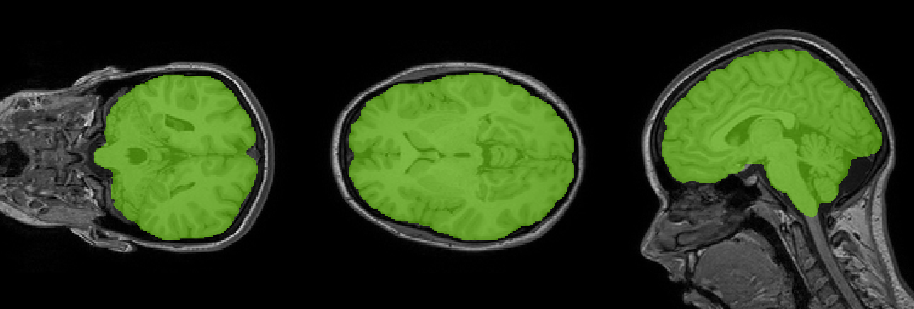

# DeepBrain

> Brain image processing tools using Deep Learning focused on speed and accuracy.

## Available tools:

### Extractor



> Extract brain tissue from T1 Brain MRI (i.e skull stripping).

`Extractor` runs a custom U-Net model trained on a variety of manual-verified skull-stripping datasets.

#### Speed

Extractor CPU (i5 2015 MBP)          |  Extractor GPU (Nvidia TitanXP) 
:-------------------------:|:-------------------------:
~20 seconds  | ~2 seconds

#### Accuracy

`Extractor` achieves state-of-the art accuracy > **0.97 Dice metric** on the test set that is compound with a subset of entries from the [CC359 dataset](https://sites.google.com/view/calgary-campinas-dataset/home), [NFBS dataset](http://preprocessed-connectomes-project.org/NFB_skullstripped/) and [ADNI dataset](http://doid.gin.g-node.org/aa605acf0f2335b9b8dfdb5c66e18f68/).

#### How to run

##### As command line program

```bash
$ deepbrain-extractor -i brain_mri.nii.gz -o ~/Desktop/output/
```

See `deepbrain-extractor -h` for more information.

##### As python

```python
import nibabel as nb
from deepbrain import Extractor

# Load a nifti as 3d numpy image [H, W, D]
img = nib.load(img_path).get_fdata()

ext = Extractor()

# `prob` will be a 3d numpy image containing probability 
# of being brain tissue for each of the voxels in `img`
prob = ext.run(img) 

# mask can be obtained as:
mask = prob > 0.5
```

See `deepbrain-extractor -h` for more information.
